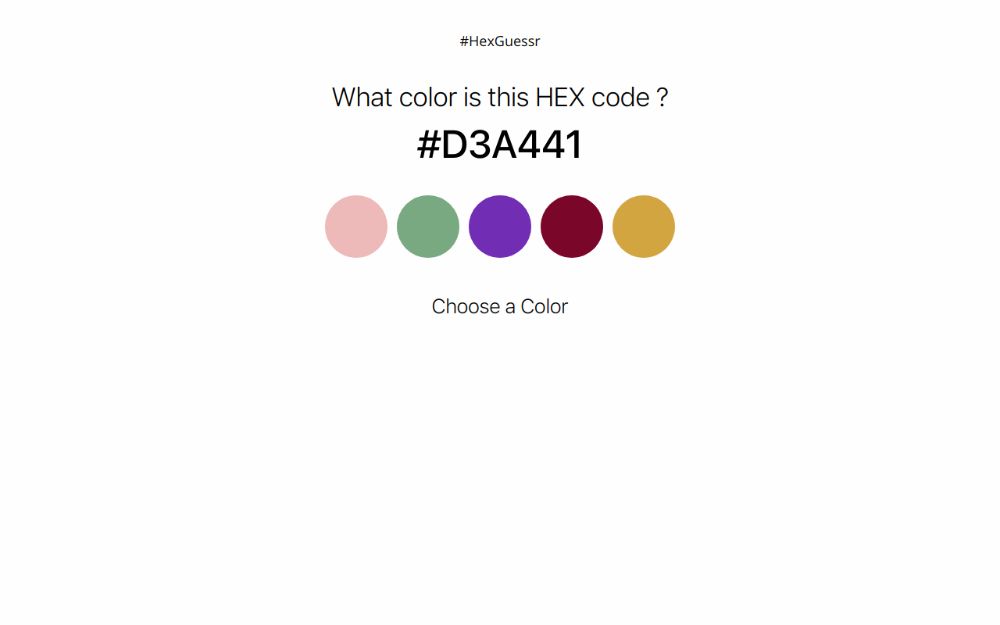

# #HexGuessr

**Guess which color corresponds to a given hexadecimal color code.**

This application was developed in :
- JavaScript ES6 Syntax
- HTML5
- CSS3

*Loosely based on* [What the Hex?](http://yizzle.com/whatthehex/)

